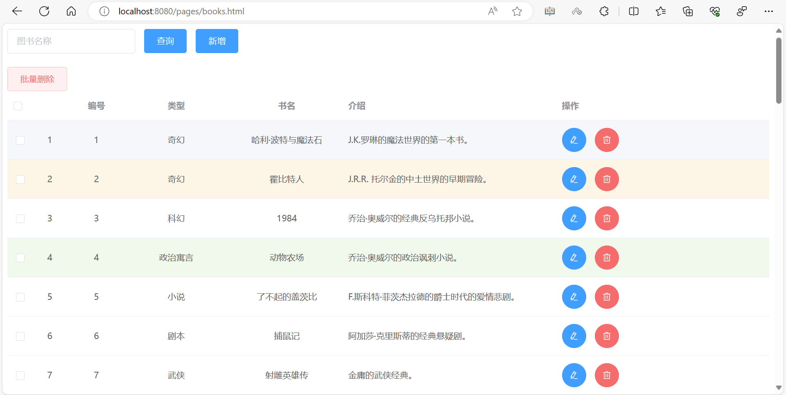
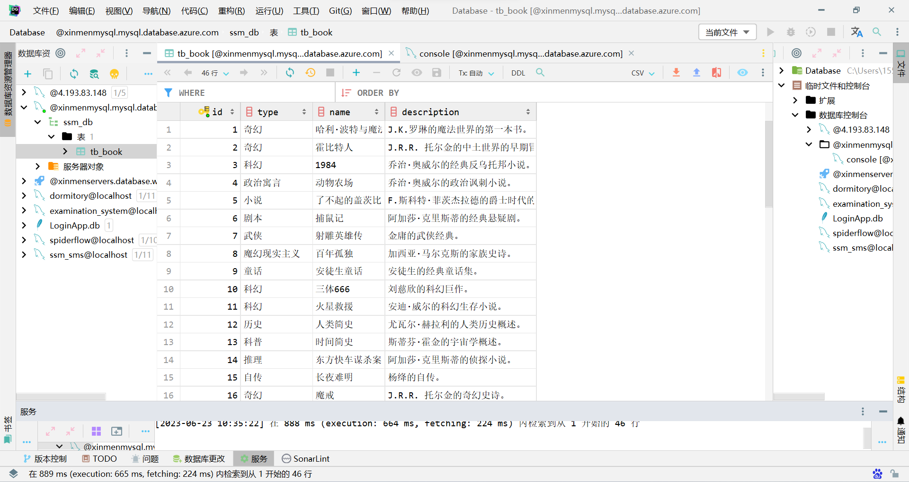
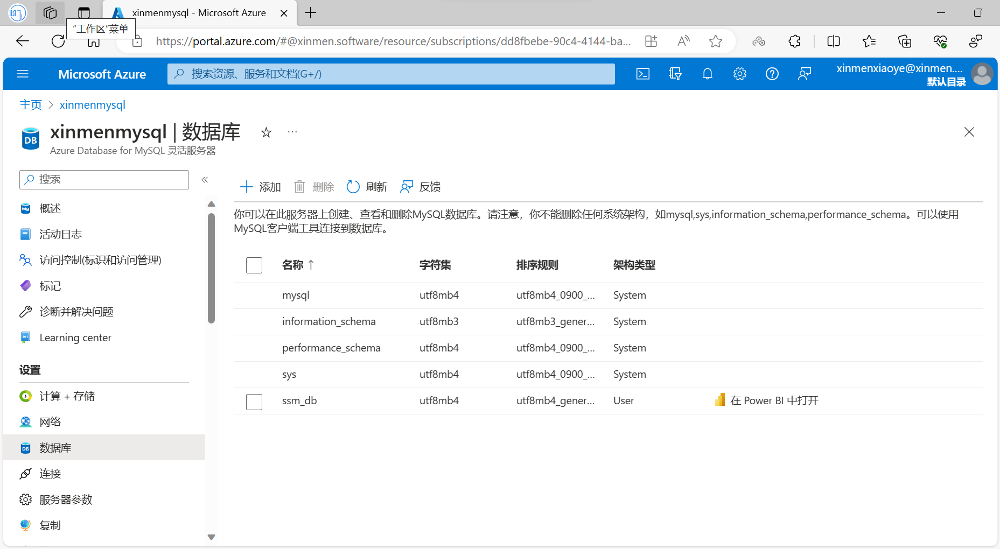

# SpringBoot

## 1. SpringBoot简介

MyBatis：一个用于Java的数据库交互框架。
Vue.js：一个用于构建用户界面的JavaScript框架。
Axios：一个用于发送HTTP请求的JavaScript库。
Spring Boot：一个用于创建Java微服务的框架。
Maven：一个用于Java项目管理和自动化构建的工具。
微软云数据库：微软Azure提供的云数据库服务。

图片

